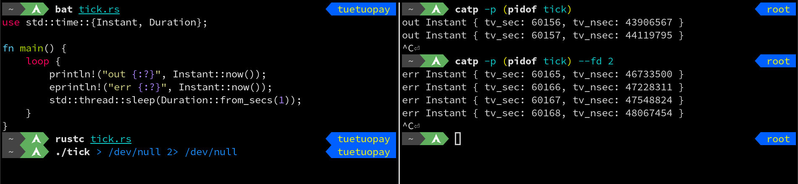

# catp-ebpf

Print the output of a _running_ process (or any of its open fd) like
[`catp`](https://github.com/rapiz1/catp) does, but using eBPF instead of `ptrace`.

## Prerequisites

1. Install a rust stable toolchain: `rustup install stable`
1. Install a rust nightly toolchain: `rustup install nightly`
1. Install bpf-linker: `cargo install bpf-linker`

## Build eBPF

```bash
cargo xtask build-ebpf
```

## Build Userspace

```bash
cargo build
```

## Run

```bash
cargo xtask run -- -p <PID>
```

## Examples


